# Outline

## Base structure
- Use both discrete and continuous
  - for math impact and realism
- Bayesian and conditional risk results
  - for math impact
- Discuss bias/variance SE trade-off
  - nice plots, link to math
  - model estimation perspective, too?
- **Real data APPLICATION**
  - Discretization of continuous data!?

## Outstanding goals
- Non-trivial data support for discrete results
  - realism for reader
- Find a sensible application for "countable" continuous data support
  - Needed to make continuous Dirichlet viable
    - **Discretization**
- Compare to classic algorithms (Normal regressor)
  - help reader relate
  - demonstrate Dirichlet consistency vs Normal loss

# Discrete set results

- X_set = Y_set = uniform grid on [0, 1]
- p_x(x) = constant
- p_y_x(x) = EmpiricalScalar(n_grid, true_mean(x))

## Conditional risk

**REMAKE plots with proper number of values y**

<!-- ## Loss vs N, vs Norm
- 16 point [0, 1] grid
- Normal: 1st order mean, cov_y_x=.1

### biased mean
- true mean: f(x) = x**3
- prior mean: f(x) = .5

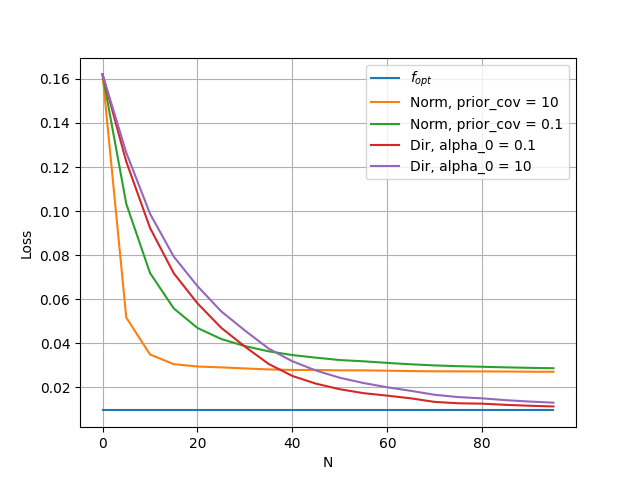

### unbiased mean
- true mean: f(x) = .5
- prior mean: f(x) = .5

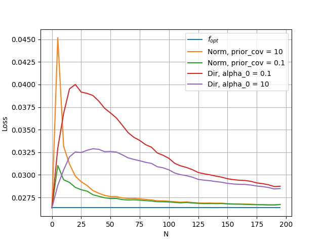 -->

### Loss vs N, vs Norm, poly
- true_mean(x) = x**2
- Normal: cov_y_x=.1, prior_cov=10 ?

#### unbiased mean
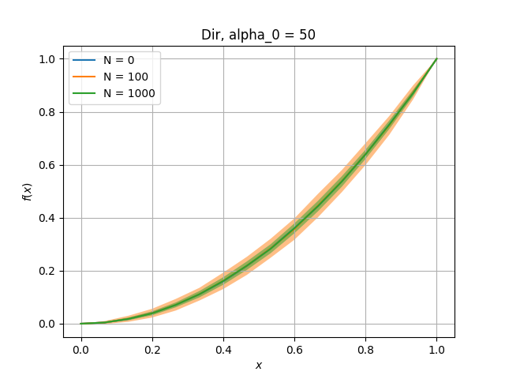

- Norm order = 2
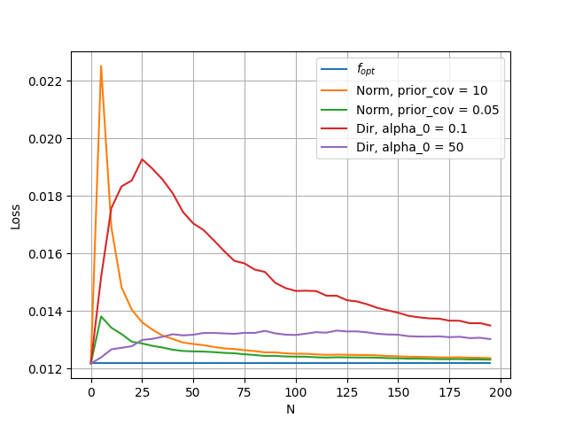
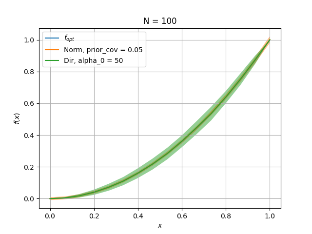

#### biased mean, f(x) = .5
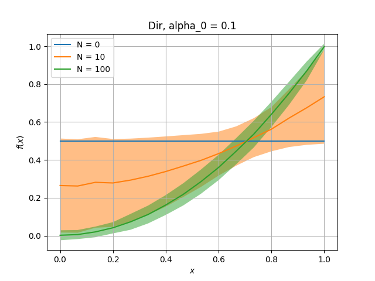
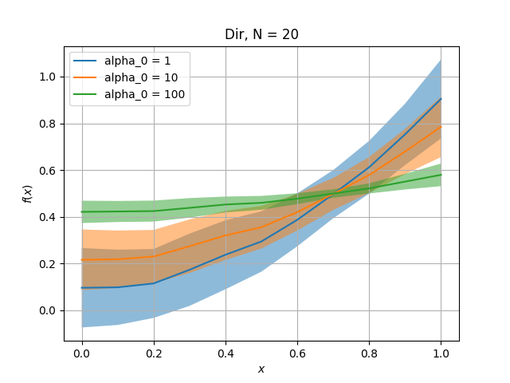

- Norm order = 1
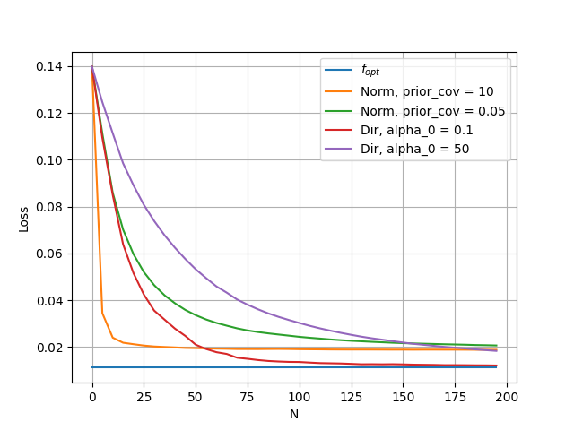
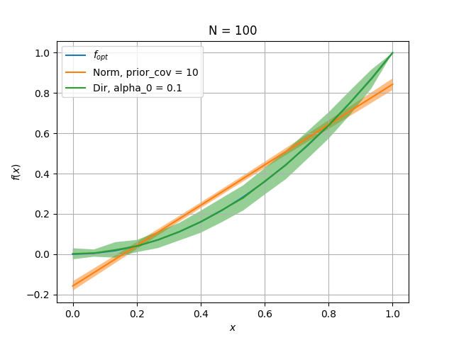
- Norm order = 2
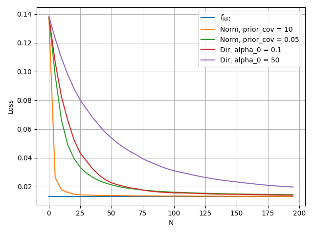

### Loss vs N, vs Norm, hard non-poly
- true_mean(x) = 1 / (2 + sin(2*pi* x))
- Normal: cov_y_x=.1

#### biased mean, f(x) = .5
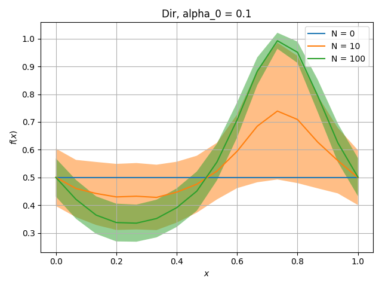
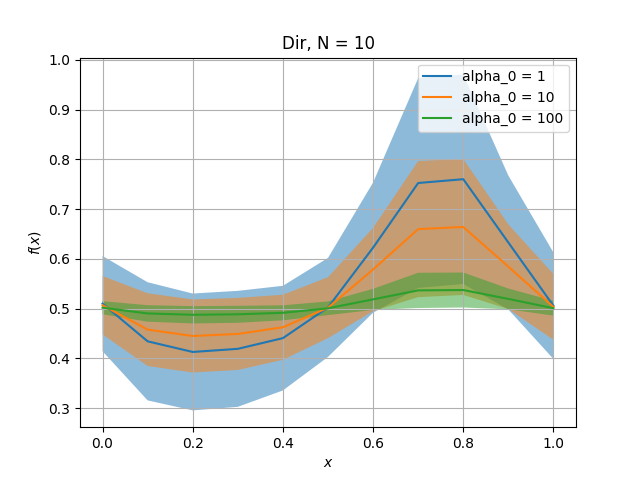

- Norm order = 2
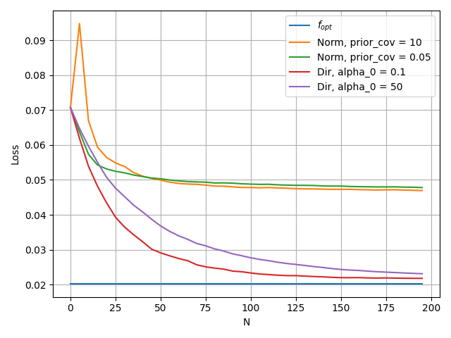
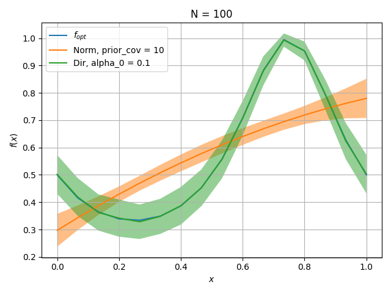

### Loss vs alpha_0
- true_mean(x) = .3 + .4* x**2

#### unbiased

#### biased mean, f(x) = .5

## Bayesian risk
- true_mean(x) = .5
- true alpha_0 = 10
- NOTE: set = {0, .1, ... , 1}

### Loss vs N
- unbiased
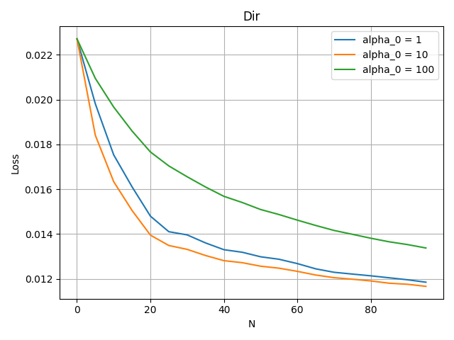

### Loss vs alpha_0
- unbiased (note correct minima)
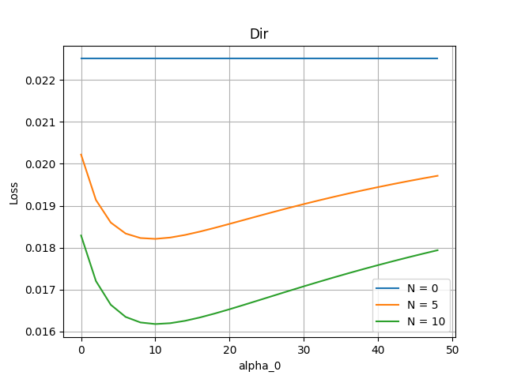

# Continuous set results

- X_set = Y_set = uniform on [0, 1]
- p_x(x) = 1 (constant)
- p_y_x(x) = Beta(alpha_y_x * true_mean(x), alpha_y_x * (1 - true_mean(x)))
  - alpha_y_x = 100

## Conditional risk
### Loss vs N, vs Norm, poly
- true_mean(x) = x**2
- Normal: cov_y_x=.1, prior_cov=10 ?

#### biased mean, f(x) = .5
NOTE: plotting missed at training data points
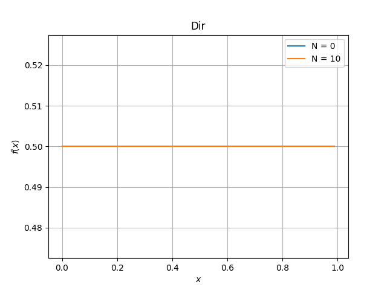

- Norm order = 1

## Bayesian risk
- true_mean(x) = .5
- true alpha_0 = 10

### Loss vs N
- unbiased
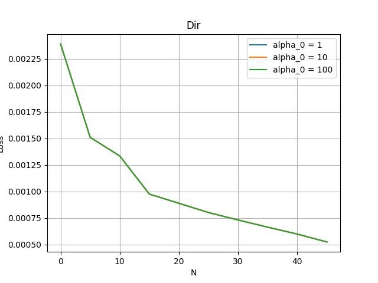

### Loss vs alpha_0
- unbiased
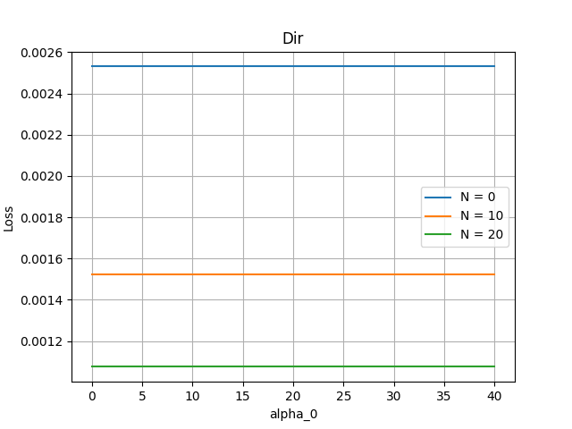
