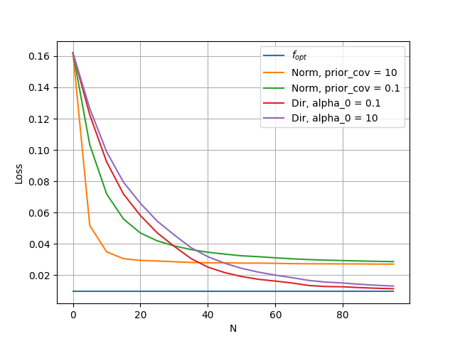

- Use both discrete and continuous
  - for math impact and realism
- Bayesian and conditional risk results
  - for math impact
- Discuss bias/variance SE trade-off
  - nice plots, link to math
  - model estimation perspective, too?

# Primary objectives
- Non-trivial data support for discrete results
  - realism for reader
- Find a sensible application for "countable" continuous data support
  - Needed to make continuous Dirichlet viable
- Compare to classic algorithms (Normal regressor)
  - help reader relate
  - demonstrate Dirichlet consistency vs Normal loss

# Results log

### dir vs norm, biased mean
- 16 point [0, 1] grid
- prior mean: f(x) = .5
- true mean: f(x) = x**3
- Normal: 1st order mean, cov_y_x=.1

### 2 - alpha_0 loss min
.5 + .2*x true mean
up to 100 a_0
