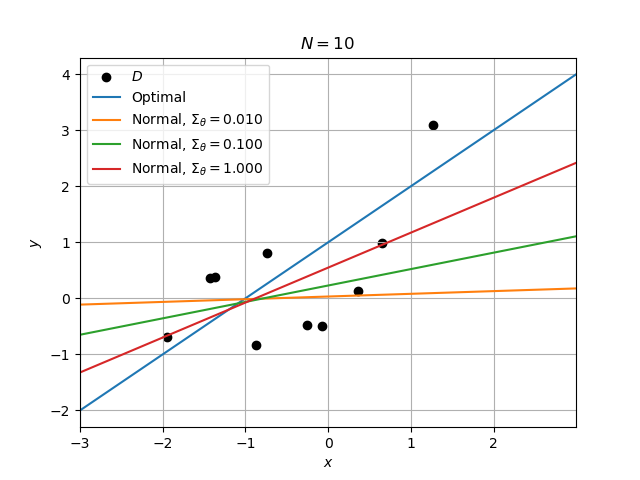
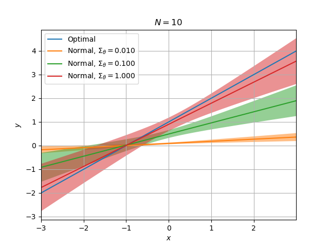
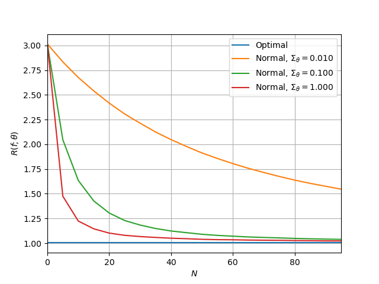

# Statistical Learning
**Note**: This project is under active development.

This package provides a framework to explore statistical learning with a Bayesian focus. It implements a variety of
`random.elements`, as well as `random.models` of data for supervised learning. The `bayes` subpackage
implements similar elements/models with `prior` attributes to statistically characterize parameter uncertainty and
`fit` methods to adapt posteriors.

For supervised learning, the `predictors` subpackage provides objects that use these statistical models to define
inference and decision functions. Additionally, customization enables comparison with learning objects from popular
machine learning packages. The `predictors.torch` submodule uses [PyTorch](https://pytorch.org/)
(and [PyTorch Lightning](https://www.pytorchlightning.ai/)) to implement neural networks in the `stats_learn` API.

Also included (in the `results` submodule) are various functions that enable fair and reproducible evaluations, as
well as provide visualizations and Markdown-formatted output. Furthermore, they allow efficient assessments for learners
across a set of hyperparameter values.

## Installation
The `stats_learn` package can installed directly from GitHub using
```
pip install git+https://github.com/rademacher-p/stats-learn.git
```
To install a specific version or branch, specify a ref as detailed [here](https://pip.pypa.io/en/stable/topics/vcs-support/). Alternatively, the package can be installed locally using
```
git clone https://github.com/rademacher-p/stats-learn.git
pip install .
```
Note that with both methods, the [editable option](https://pip.pypa.io/en/stable/cli/pip_install/) can be included to track any package modifications.

## Documentation
API documentation can be generated using the `sphinx` package and the `sphinx-rtd-theme`, both installable using `pip`. To build the HTML documentation, run `make html` from the `docs/` folder; the top level document will be `docs/build/html/index.html`

## Quickstart
A basic example of model creation, learner definition, and performance assessment is shown below. The `model`
attribute defines a jointly Normal distribution where the expected value of `y` conditioned on `x` is characterized
by a polynomial function.

Two different predictors are instantiated. First, the `opt_predictor` uses knowledge of the `model` to
determine the optimal `predict` function. Second, a learning regressor is formulated using a Bayesian data
model `norm_model`; this object implements a Normal distribution `norm_model.prior` to characterize uncertainty about
the true model `weights`.

Training and testing data are randomly generated using the model `sample` method and each predictor is assessed
using its `evaluate` method. Once the learning `norm_predictor` is `fit` to the data, its squared-error loss is reduced.

```python
import matplotlib.pyplot as plt

from stats_learn import bayes, random
from stats_learn.predictors import BayesRegressor, ModelRegressor

plt.interactive(True)

model = random.models.NormalLinear(weights=[1, 1])

# Predictors
opt_predictor = ModelRegressor(model, name='Optimal')

norm_model = bayes.models.NormalLinear(prior_mean=[0, 0], prior_cov=1)
norm_predictor = BayesRegressor(norm_model, name='Normal')

# Results
seed = 12345
n_train = 10
n_test = 20

d = model.sample(n_train + n_test, rng=seed)
d_train, d_test = d[:n_train], d[n_train:]

loss_min = opt_predictor.evaluate(d_test)
print(f"Minimum loss = {loss_min:.3f}")

loss_prior = norm_predictor.evaluate(d_test)  # use the prior distribution
print(f"Untrained learner loss = {loss_prior:.3f}")

norm_predictor.fit(d_train)  # fit the posterior distribution
loss_fit = norm_predictor.evaluate(d_test)
print(f"Trained learner loss = {loss_fit:.3f}")
```

Output:
```
Minimum loss = 0.549
Prior learner loss = 3.413
Trained learner loss = 0.951
```

The code below can be executed after the previous snippet. The `data_assess` function provides replication of the
functionality above, including a loss table and a graphic showing how the `predict` functions fit the training data.
The `model_assess` function performs Monte Carlo approximation of the expected loss by repeatedly generating and
evaluating on new datasets, enabling statistically meaningful evaluation. Observe that it can be used for both
visualization of both the prediction statistics and of the average loss.

```python
from stats_learn import results

predictors = [opt_predictor, norm_predictor]
params = [None, {'prior_cov': [.01, .1, 1]}]

# Sample regressor realizations
results.data_assess(predictors, d_train, d_test, params, verbose=True, plot_fit=True)

# Prediction mean/variance
results.model_assess(
    predictors,
    model,
    params,
    n_train,
    n_test,
    n_mc=1000,
    stats=("mean", "std"),
    verbose=True,
    plot_stats=True,
    print_loss=True,
    rng=seed,
)

# Squared-Error vs. training data volume
n_train = range(0, 100, 5)
results.model_assess(
    predictors,
    model,
    params,
    n_train,
    n_test,
    n_mc=1000,
    verbose=True,
    plot_loss=True,
    rng=seed,
)
```

Output:



|                                 |    10 |
|---------------------------------|-------|
| Optimal                         | 0.549 |
| Normal, $\Sigma_\theta = 0.010$ | 3.171 |
| Normal, $\Sigma_\theta = 0.100$ | 2.034 |
| Normal, $\Sigma_\theta = 1.000$ | 0.951 |



|                                 |    10 |
|---------------------------------|-------|
| Optimal                         | 1.005 |
| Normal, $\Sigma_\theta = 0.010$ | 2.689 |
| Normal, $\Sigma_\theta = 0.100$ | 1.629 |
| Normal, $\Sigma_\theta = 1.000$ | 1.205 |



## Examples
Scripts for reproduction of results are located in the `examples` directory. They can be invoked from the
command line and given a variety of arguments to control the simulations. A demonstrative help message is shown below:
```
usage: consistency.py [-h] [-m MC] [-l LOG_PATH] [-i] [--style STYLE] [--seed SEED]
                      [{fit,predict_a0,predict_N,risk_N_leg_a0,risk_a0_leg_N} ...]

Example: consistent regressor on a discrete domain

positional arguments:
  {fit,predict_a0,predict_N,risk_N_leg_a0,risk_a0_leg_N}
                        Simulations to run

optional arguments:
  -h, --help            show this help message and exit
  -m MC, --mc MC        Number of Monte Carlo iterations
  -l LOG_PATH, --log_path LOG_PATH
                        Path to log file
  -i, --save_img        Save images to log
  --style STYLE         Path to .mplstyle Matplotlib style
  --seed SEED           RNG seed

```
An exemplifying usage from the package top level is:
```commandline
python examples\discrete\regression\consistency.py -m 1000 -l log.md -i --style images/style.mplstyle --seed 12345 fit risk_N_leg_a0
```

The `--log_path` and `--save_img` options enable logging of result tables and/or images into a Markdown-format file
for future use; note that the specified log path file will be created if it does not exist. Additionally, note that
a specific [Matplotlib](https://matplotlib.org/) `--style` can be specified for custom formatting. To implement the
same formatting used throughout the publication, the provided style `images/style.mplstyle` can be used (as shown
above); note that this style requires [LaTeX](https://www.latex-project.org/), as well as the
[bm](https://www.ctan.org/pkg/bm) and [upgreek](https://www.ctan.org/pkg/upgreek) packages.
