# 2021-07-24T08_41_07
n_mc = 10

|                                 |     1 |     2 |     4 |     8 |    16 |    32 |    64 |   128 |   256 |   512 |   1024 |
|---------------------------------|-------|-------|-------|-------|-------|-------|-------|-------|-------|-------|--------|
| $f_{\Theta}(\theta)$            | 0.032 | 0.032 | 0.032 | 0.032 | 0.032 | 0.032 | 0.032 | 0.032 | 0.032 | 0.032 |  0.032 |
| $\Dir$, $\alpha_0 = 1e-06$      | 0.122 | 0.122 | 0.121 | 0.119 | 0.115 | 0.109 | 0.098 | 0.083 | 0.061 | 0.045 |  0.037 |
| $\Dir$, $\alpha_0 = 1000000.0$  | 0.122 | 0.122 | 0.122 | 0.122 | 0.122 | 0.122 | 0.122 | 0.122 | 0.122 | 0.122 |  0.122 |
| Lit MLP 500-500-500, 0.0 reg.   | 0.244 | 0.266 | 0.262 | 0.243 | 0.204 | 0.171 | 0.150 | 0.119 | 0.088 | 0.072 |  0.066 |
| Lit MLP 500-500-500, 0.001 reg. | 0.247 | 0.268 | 0.258 | 0.224 | 0.186 | 0.160 | 0.132 | 0.122 | 0.116 | 0.116 |  0.116 |

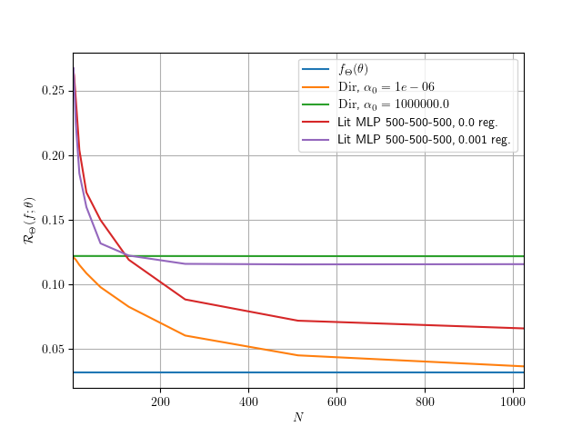

# 2021-07-24T10_34_31
n_mc = 10

|                                 |     1 |     2 |     4 |     8 |    16 |    32 |    64 |   128 |   256 |   512 |   1024 |
|---------------------------------|-------|-------|-------|-------|-------|-------|-------|-------|-------|-------|--------|
| $f_{\Theta}(\theta)$            | 0.032 | 0.032 | 0.032 | 0.032 | 0.032 | 0.032 | 0.032 | 0.032 | 0.032 | 0.032 |  0.032 |
| $\Dir$, $\alpha_0 = 1e-06$      | 0.122 | 0.122 | 0.121 | 0.119 | 0.115 | 0.109 | 0.098 | 0.083 | 0.061 | 0.045 |  0.037 |
| $\Dir$, $\alpha_0 = 1000000.0$  | 0.122 | 0.122 | 0.122 | 0.122 | 0.122 | 0.122 | 0.122 | 0.122 | 0.122 | 0.122 |  0.122 |
| Lit MLP 500-500-500, 0.0 reg.   | 0.247 | 0.267 | 0.264 | 0.248 | 0.206 | 0.176 | 0.149 | 0.117 | 0.089 | 0.070 |  0.067 |
| Lit MLP 500-500-500, 0.001 reg. | 0.240 | 0.254 | 0.260 | 0.235 | 0.187 | 0.159 | 0.131 | 0.121 | 0.116 | 0.115 |  0.116 |

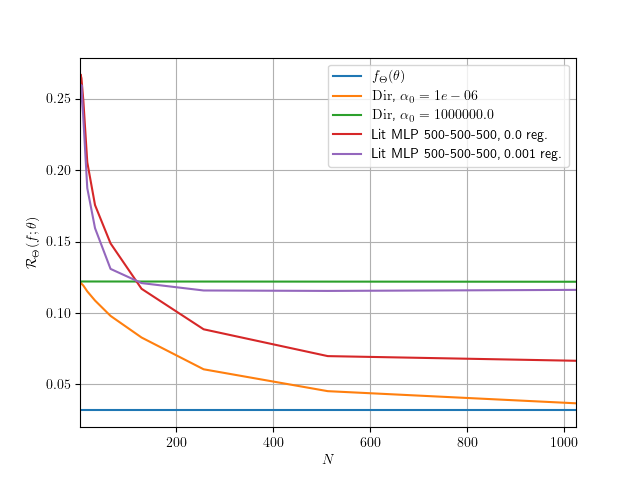

# 2021-07-24T17_22_50
- MC iterations: 5

|                                 |     1 |     2 |     4 |     8 |    16 |    32 |    64 |   128 |   256 |   512 |   1024 |
|---------------------------------|-------|-------|-------|-------|-------|-------|-------|-------|-------|-------|--------|
| $f_{\Theta}(\theta)$            | 0.036 | 0.036 | 0.036 | 0.036 | 0.036 | 0.036 | 0.036 | 0.036 | 0.036 | 0.036 |  0.036 |
| $\Dir$, $\alpha_0 = 1e-06$      | 0.113 | 0.113 | 0.113 | 0.111 | 0.108 | 0.099 | 0.092 | 0.077 | 0.061 | 0.049 |  0.040 |
| $\Dir$, $\alpha_0 = 1000000.0$  | 0.114 | 0.114 | 0.114 | 0.114 | 0.114 | 0.114 | 0.114 | 0.114 | 0.114 | 0.113 |  0.113 |
| Lit MLP 500-500-500, 0.0 reg.   | 0.193 | 0.264 | 0.188 | 0.199 | 0.198 | 0.172 | 0.139 | 0.112 | 0.072 | 0.054 |  0.045 |
| Lit MLP 500-500-500, 0.001 reg. | 0.211 | 0.250 | 0.181 | 0.187 | 0.172 | 0.142 | 0.114 | 0.107 | 0.102 | 0.101 |  0.101 |

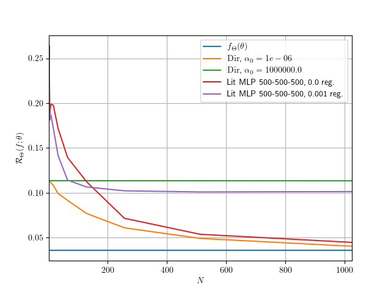

# BEST RESULTS:

### 2021-07-25T11_13_28
- MC iterations: 5

|                                     |     1 |     2 |     4 |     8 |    16 |    32 |    64 |   128 |   256 |   512 |   1024 |
|-------------------------------------|-------|-------|-------|-------|-------|-------|-------|-------|-------|-------|--------|
| $f_{\Theta}(\theta)$                | 0.036 | 0.036 | 0.036 | 0.036 | 0.036 | 0.036 | 0.036 | 0.036 | 0.036 | 0.036 |  0.036 |
| $\Dir$, $\alpha_0 = 1e-06$          | 0.113 | 0.113 | 0.113 | 0.111 | 0.108 | 0.099 | 0.092 | 0.077 | 0.061 | 0.049 |  0.040 |
| $\Dir$, $\alpha_0 = 1000000.0$      | 0.114 | 0.114 | 0.114 | 0.114 | 0.114 | 0.114 | 0.114 | 0.114 | 0.114 | 0.113 |  0.113 |
| Lit MLP 500-500-500-500, 0.0 reg.   | 0.196 | 0.245 | 0.184 | 0.209 | 0.203 | 0.177 | 0.138 | 0.114 | 0.075 | 0.053 |  0.043 |
| Lit MLP 500-500-500-500, 0.001 reg. | 0.211 | 0.250 | 0.185 | 0.185 | 0.166 | 0.156 | 0.119 | 0.108 | 0.102 | 0.100 |  0.100 |

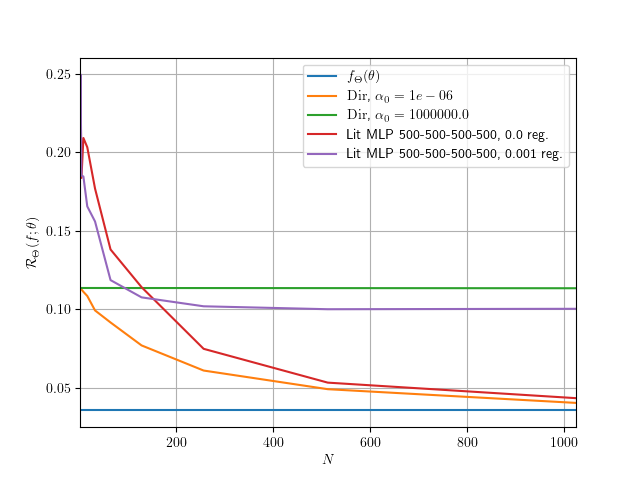

# 2021-07-25T14_35_53
- MC iterations: 5

|                                   |   128 |
|-----------------------------------|-------|
| $f_{\Theta}(\theta)$              | 0.035 |
| $\Dir$, $\alpha_0 = 1e-06$        | 0.080 |
| $\Dir$, $\alpha_0 = 1000000.0$    | 0.114 |
| Lit MLP 500-500-500-500, 0.0 reg. | 0.110 |

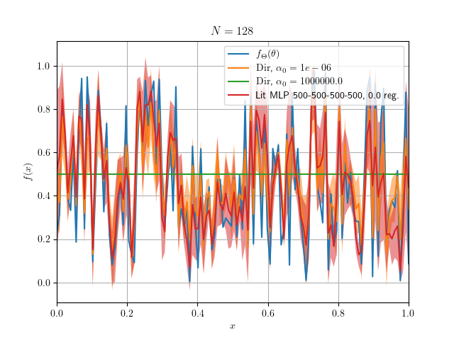

# 2021-07-25T18_43_28
- MC iterations: 5

|                                |   128 |
|--------------------------------|-------|
| $f_{\Theta}(\theta)$           | 0.035 |
| $\Dir$, $\alpha_0 = 1e-06$     | 0.080 |
| $\Dir$, $\alpha_0 = 1000000.0$ | 0.114 |

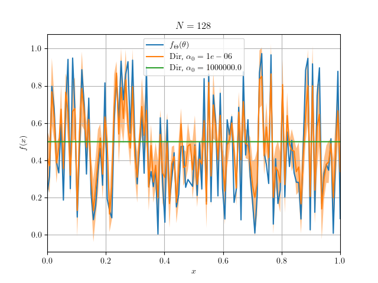

# 2021-07-25T18_44_02
- MC iterations: 5

|                                     |   128 |
|-------------------------------------|-------|
| $f_{\Theta}(\theta)$                | 0.035 |
| Lit MLP 500-500-500-500, 0.0 reg.   | 0.111 |
| Lit MLP 500-500-500-500, 0.001 reg. | 0.111 |

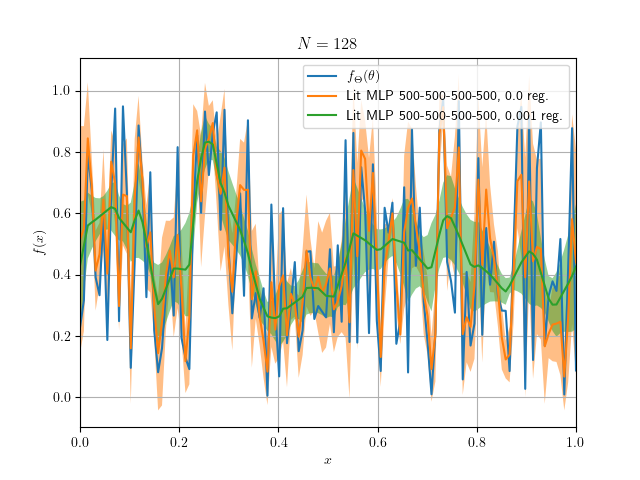

# Low Variance Results

### 2021-07-30T15_29_12
- MC iterations: 5

|                                   |   128 |
|-----------------------------------|-------|
| $f_{\Theta}(\theta)$              | 0.001 |
| $\Dir$, $\alpha_0 = 1e-05$        | 0.027 |
| $\Dir$, $\alpha_0 = 100000.0$     | 0.075 |
| $\mathrm{MLP}$, $\lambda = 0.0$   | 0.055 |
| $\mathrm{MLP}$, $\lambda = 0.001$ | 0.069 |

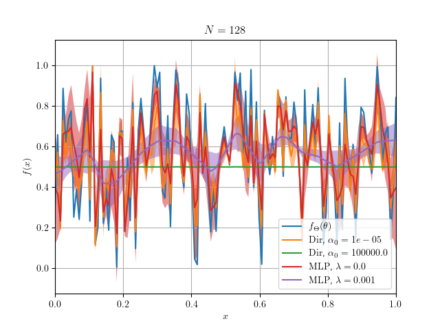

### 2021-07-30T15_28_15
- MC iterations: 5

|                               |   128 |
|-------------------------------|-------|
| $f_{\Theta}(\theta)$          | 0.001 |
| $\Dir$, $\alpha_0 = 1e-05$    | 0.027 |
| $\Dir$, $\alpha_0 = 100000.0$ | 0.075 |

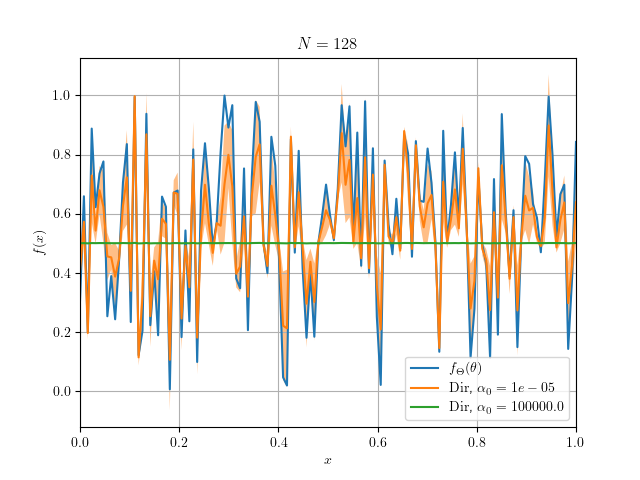

### 2021-07-30T15_46_06
- MC iterations: 5

|                                   |   128 |
|-----------------------------------|-------|
| $f_{\Theta}(\theta)$              | 0.001 |
| $\mathrm{MLP}$, $\lambda = 0.0$   | 0.055 |
| $\mathrm{MLP}$, $\lambda = 0.001$ | 0.069 |

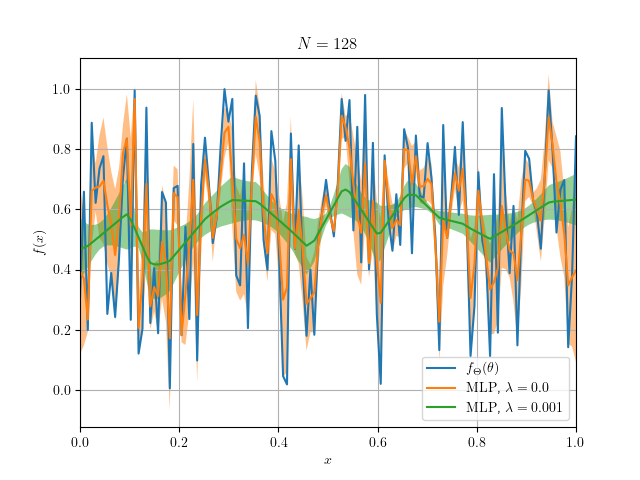

### 2021-07-30T16_04_23
- MC iterations: 5

|                                   |     1 |     2 |     4 |     8 |    16 |    32 |    64 |   128 |   256 |   512 |   1024 |
|-----------------------------------|-------|-------|-------|-------|-------|-------|-------|-------|-------|-------|--------|
| $f_{\Theta}(\theta)$              | 0.001 | 0.001 | 0.001 | 0.001 | 0.001 | 0.001 | 0.001 | 0.001 | 0.001 | 0.001 |  0.001 |
| $\Dir$, $\alpha_0 = 1e-05$        | 0.073 | 0.072 | 0.071 | 0.068 | 0.063 | 0.056 | 0.044 | 0.027 | 0.012 | 0.003 |  0.002 |
| $\Dir$, $\alpha_0 = 100000.0$     | 0.074 | 0.074 | 0.074 | 0.074 | 0.074 | 0.074 | 0.074 | 0.074 | 0.073 | 0.073 |  0.072 |
| $\mathrm{MLP}$, $\lambda = 0.0$   | 0.140 | 0.157 | 0.150 | 0.147 | 0.139 | 0.111 | 0.093 | 0.056 | 0.033 | 0.007 |  0.005 |
| $\mathrm{MLP}$, $\lambda = 0.001$ | 0.135 | 0.156 | 0.137 | 0.135 | 0.123 | 0.096 | 0.079 | 0.066 | 0.065 | 0.067 |  0.065 |

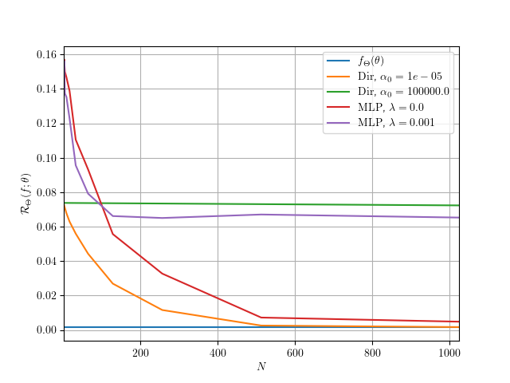

### 2021-07-30T22_07_58
- MC iterations: 5

|                                   |     1 |    20 |    40 |    60 |    80 |   100 |   120 |   140 |   160 |   180 |   200 |   220 |   240 |   260 |   280 |   300 |   320 |   340 |   360 |   380 |   400 |   420 |   440 |   460 |   480 |   500 |   520 |   540 |   560 |   580 |   600 |   620 |   640 |   660 |   680 |   700 |   720 |   740 |   760 |   780 |   800 |
|-----------------------------------|-------|-------|-------|-------|-------|-------|-------|-------|-------|-------|-------|-------|-------|-------|-------|-------|-------|-------|-------|-------|-------|-------|-------|-------|-------|-------|-------|-------|-------|-------|-------|-------|-------|-------|-------|-------|-------|-------|-------|-------|-------|
| $f_{\Theta}(\theta)$              | 0.001 | 0.001 | 0.001 | 0.001 | 0.001 | 0.001 | 0.001 | 0.001 | 0.001 | 0.001 | 0.001 | 0.001 | 0.001 | 0.001 | 0.001 | 0.001 | 0.001 | 0.001 | 0.001 | 0.001 | 0.001 | 0.001 | 0.001 | 0.001 | 0.001 | 0.001 | 0.001 | 0.001 | 0.001 | 0.001 | 0.001 | 0.001 | 0.001 | 0.001 | 0.001 | 0.001 | 0.001 | 0.001 | 0.001 | 0.001 | 0.001 |
| $\Dir$, $\alpha_0 = 1e-05$        | 0.080 | 0.068 | 0.058 | 0.048 | 0.041 | 0.034 | 0.028 | 0.024 | 0.021 | 0.019 | 0.017 | 0.014 | 0.012 | 0.011 | 0.010 | 0.009 | 0.008 | 0.008 | 0.007 | 0.006 | 0.006 | 0.005 | 0.004 | 0.004 | 0.004 | 0.004 | 0.003 | 0.003 | 0.003 | 0.002 | 0.002 | 0.002 | 0.002 | 0.002 | 0.002 | 0.002 | 0.002 | 0.002 | 0.002 | 0.002 | 0.002 |
| $\Dir$, $\alpha_0 = 100000.0$     | 0.080 | 0.080 | 0.080 | 0.080 | 0.080 | 0.080 | 0.080 | 0.080 | 0.080 | 0.080 | 0.080 | 0.080 | 0.080 | 0.080 | 0.080 | 0.080 | 0.080 | 0.080 | 0.080 | 0.080 | 0.080 | 0.080 | 0.080 | 0.080 | 0.080 | 0.080 | 0.079 | 0.079 | 0.079 | 0.079 | 0.079 | 0.079 | 0.079 | 0.079 | 0.079 | 0.079 | 0.079 | 0.079 | 0.079 | 0.079 | 0.079 |
| $\mathrm{MLP}$, $\lambda = 0.0$   | 0.129 | 0.142 | 0.116 | 0.085 | 0.079 | 0.069 | 0.059 | 0.049 | 0.048 | 0.042 | 0.038 | 0.036 | 0.030 | 0.026 | 0.027 | 0.023 | 0.025 | 0.023 | 0.020 | 0.017 | 0.020 | 0.015 | 0.012 | 0.015 | 0.015 | 0.014 | 0.013 | 0.011 | 0.013 | 0.009 | 0.008 | 0.008 | 0.016 | 0.008 | 0.014 | 0.013 | 0.012 | 0.011 | 0.005 | 0.016 | 0.012 |
| $\mathrm{MLP}$, $\lambda = 0.001$ | 0.147 | 0.124 | 0.091 | 0.082 | 0.077 | 0.072 | 0.070 | 0.069 | 0.069 | 0.068 | 0.067 | 0.067 | 0.067 | 0.067 | 0.067 | 0.066 | 0.067 | 0.066 | 0.067 | 0.066 | 0.066 | 0.067 | 0.066 | 0.066 | 0.066 | 0.066 | 0.066 | 0.066 | 0.066 | 0.066 | 0.068 | 0.067 | 0.067 | 0.067 | 0.066 | 0.066 | 0.066 | 0.068 | 0.067 | 0.066 | 0.066 |

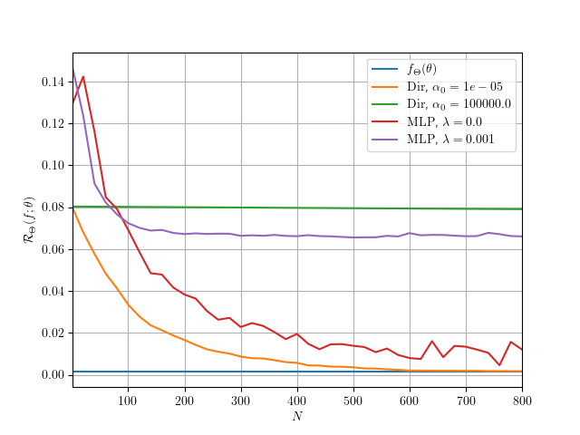

# Low Variance + NN init control

### 2021-08-20T11_20_13
- MC iterations: 5

|                                   |   128 |
|-----------------------------------|-------|
| $f_{\Theta}(\theta)$              | 0.001 |
| $\Dir$, $\alpha_0 = 1e-05$        | 0.028 |
| $\Dir$, $\alpha_0 = 100000.0$     | 0.081 |
| $\mathrm{MLP}$, $\lambda = 0.0$   | 0.062 |
| $\mathrm{MLP}$, $\lambda = 0.001$ | 0.080 |

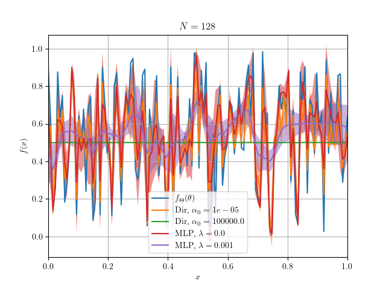